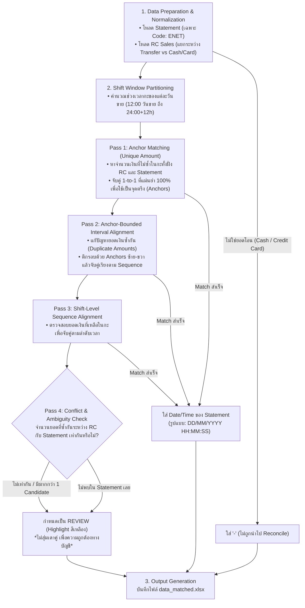

# Flow การ Reconcile และจับคู่ข้อมูล ENET vs RC (Matching Flow)

เอกสารอธิบายสถาปัตยกรรมและขั้นตอนการทำงานของสคริปต์ Reconcile [`match.py`](match.py) สำหรับจับคู่ข้อมูลระหว่าง **ยอดขาย POS (RC จาก data.xlsx)** และ **รายการเงินเข้าบัญชีธนาคาร (ENET จาก statement.xlsx)**

---

## 1. แผนภาพภาพรวมการทำงาน (Overview Diagram)



---

## 2. รายละเอียดแต่ละขั้นตอน (Detailed Step-by-Step Flow)

### ขั้นตอนที่ 1: การเตรียมข้อมูล (Data Preparation & Normalization)
1. **SCB Bank Statement (`statement.xlsx`)**: 
   - คัดกรองเฉพาะรายการโอนเงินเข้า `Code: ENET` / `Channel: XP` (ข้ามรายการที่ไม่เกี่ยวข้อง เช่น รายการจ่ายค่าใช้จ่ายร้าน `BCMS` หรือรายการถอน)
   - ปรับ Format วันที่และเวลาให้อยู่ในรูปแบบมาตรฐาน
   - ตรวจสอบจำนวนเงินให้อยู่ในรูปแบบ numeric float โดยไม่แก้ไขหรือดัดแปลงตัวเลขต้นฉบับ
2. **POS Receipt (`data.xlsx`)**:
   - ตรวจสอบยอด `Tranfer` ในแต่ละบิล
   - จัดลำดับบิลตามลำดับการออกจริง (`เลขที่บิล` / Sequence Index)
   - หากไม่มีการโอน (เช่น จ่ายสด `Cash`, บัตร `Credit Card`, หรือยอด 0) จะระบุสถานะเป็น `-` ไม่นำไป Reconcile กับเงินโอน

---

### ขั้นตอนที่ 2: การแบ่งช่วงเวลากะร้านอาหาร/ผับ (Shift Window Partitioning)
- ธุรกิจกะกลางคืน (เช่น ยอดขายวันที่ `01/01/2026`) ลูกค้าจะเริ่มชำระเงินตั้งแต่ช่วงค่ำของวันที่ `01/01/2026` ข้ามไปจนถึงช่วงดึก/เช้ามืดของวันที่ `02/01/2026` (ครอบคลุมช่วงเวลาตั้งแต่ 12:00 น. ของวันที่ D จนถึง 24:00 น. ของวันที่ D+1)
- ระบบจะจำกัดขอบเขต Statement ให้อยู่เฉพาะในกะที่ตรงกันเพื่อป้องกันการจับคู่ข้ามวัน

---

### ขั้นตอนที่ 3: กระบวนการจับคู่หลายระดับ (Multi-Pass Matching Logic)

| ลำดับ Pass | ชื่อขั้นตอน | รายละเอียดการทำงาน | ความมั่นใจ |
| :---: | :--- | :--- | :---: |
| **Pass 1** | **Unique Anchor Matching** | ในแต่ละกะ หากยอดเงินใด**ปรากฏเพียง 1 ครั้งใน RC และ 1 ครั้งใน Statement** จะจับคู่กันทันที รายการเหล่านี้จะกลายเป็น **จุดตรึง (Anchors)** ที่มีความแม่นยำสูง | **100%** |
| **Pass 2** | **Anchor-Bounded Interval Alignment** | **แก้ปัญหายอดเงินซ้ำกัน** (เช่น มีบิล 530 บาทหลายใบ):<br>• ระบบจะใช้ Anchors ที่จับคู่ได้แล้วมาเป็นกรอบเวลาบน-ล่าง<br>• หากในช่วงเวลาระหว่าง Anchors มียอด 530 บาทจำนวน $N$ รายการตรงกันทั้งสองฝั่ง ระบบจะจับคู่เรียงตามลำดับเวลาและลำดับบิล ($1 \rightarrow 1, 2 \rightarrow 2$) | **90–95%** |
| **Pass 3** | **Shift-Level Sequence Alignment** | สำหรับยอดเงินที่เหลืออยู่ในกะที่ลำดับสอดคล้องกันอย่างสมบูรณ์ | **80–85%** |
| **Pass 4** | **Ambiguity & Discrepancy Detection** | หากพบว่ายอดเงินซ้ำกันแต่**จำนวนรายการไม่เท่ากัน** (เช่น RC มี 3 ใบ แต่ Statement มี 2 รายการ):<br>• **กฎเหล็ก: ห้ามเดาคู่**<br>• กำหนดเป็นสถานะ `REVIEW` ทันที | - |

---

### ขั้นตอนที่ 4: กฎ One-to-One และการจัดการข้อผิดพลาด (Rules & Conflict Handling)
1. **One-to-One Rule**:
   - RC 1 รายการ จับคู่ Statement ได้สูงสุด 1 รายการ
   - Statement 1 รายการ ถูกใช้จับคู่ได้สูงสุด 1 รายการ
2. **ห้ามเดาคู่ (No Guessing Rule)**:
   - หากยอดเงินซ้ำกันและลำดับเวลาไม่สามารถยืนยันความสัมพันธ์ได้อย่างชัดเจน จะไม่เดาเพื่อทำให้ตัวเลขลงตัว แต่จะส่งต่อไปยังสถานะ `REVIEW`
3. **ยอดไม่ตรง / ตกหล่น**:
   - หากมีใน RC แต่ไม่พบใน Statement เลย จะได้สถานะ `REVIEW` พร้อมไฮไลต์สีเหลือง

---

### ขั้นตอนที่ 5: การสรุปผลลัพธ์ลง Excel (`data_matched.xlsx`)

โครงสร้างตารางผลลัพธ์คงคอลัมน์เดิมของ `data.xlsx` ครบถ้วน และเพิ่มคอลัมน์ `Match`:

1. **รายการที่ Match**: 
   - แสดง `Date/Time` ของ Statement ในรูปแบบ **`DD/MM/YYYY HH:MM:SS`** เช่น `01/01/2026 22:17:00`
2. **รายการที่ไม่ Match / ก้ำกึ่ง (Ambiguous / Missing in Statement)**: 
   - แสดงคำว่า **`REVIEW`**
   - **Highlight สีเหลืองสด (`#FFFF00`) ทั้งแถว** เพื่อให้ฝ่ายบัญชีตรวจสอบง่าย
3. **รายการที่ไม่ใช่การโอน (Cash / Credit Card)**: 
   - แสดงเครื่องหมาย `-`

---

## 3. ตัวอย่างผลลัพธ์ตาราง (Sample Output Table)

| date | เลขที่บิล | Cash | Credit Card | VISA | Tranfer | Match |
| :--- | :--- | :--- | :--- | :--- | :--- | :--- |
| 01/01/2026 | RC1012569/000001 | 1118 | - | NaN | - | `-` |
| 01/01/2026 | RC1012569/000002 | - | - | NaN | 4849 | `01/01/2026 22:17:00` |
| 01/01/2026 | RC1012569/000008 | - | - | NaN | 347 | `02/01/2026 00:03:00` |
| 01/01/2026 | RC1012569/000011 | - | - | NaN | 2908 | `02/01/2026 00:13:00` |
| 01/01/2026 | RC1012569/000029 | - | - | NaN | 3955 | **`REVIEW`** *(Highlight สีเหลือง)* |

---

## 4. คำสั่งสำหรับรันสคริปต์

```bash
.venv/bin/python match.py -s statement.xlsx -d data.xlsx -o data_matched.xlsx
```
